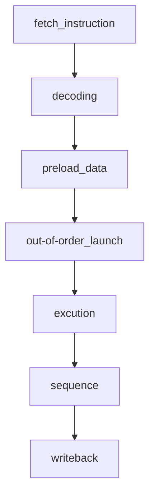

# MACPU-model

a cpu written by python.

---
## About

This is the start of the entire MACPU project, and the earliest MACPU algorithm model is this git repository.Now, the entire CPU is developing towards better performance and more complete peripherals and interfaces, so the algorithm model will be updated before the FPGA is implemented, and the FPGA implementation will be planned while the algorithm model is being designed.

For the superscalar dynamic pipeline technology commonly used in modern CPUs, I am planning the pipeline of the CPU in the case of scalar.

Not finish.

---

## Pipeline

